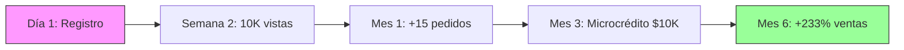

<div align="center">

# 🚀 CrediSense

### Transformando la Formalización en México
### De una Carga a una Oportunidad de Crecimiento

[](https://lovable.dev/projects/566681cf-371a-4a92-be6c-5a37c94c67bd)
[](https://www.typescriptlang.org/)
[](https://reactjs.org/)
[](https://github.com)

</div>

---

## 🎯 El Problema

En México, **56% de las microempresas operan en la informalidad**. Un pequeño comerciante informal NO VE el valor inmediato de formalizarse, solo el costo:

- ❌ Trámites complejos, impuestos, SAT, facturas
- ❌ No hay beneficios visibles inmediatos
- ❌ Los bancos no prestan aunque se formalice

### 💭 Resultado:
> **"¿Para qué formalizarme si no gano nada?"**

---

## 💡 La Solución: CrediSense

**CrediSense invierte la ecuación**: formalizarte ahora SÍ trae **beneficios inmediatos y progresivos**.

### ✨ Cómo Funciona

```
Formalización → CrediPoints → Beneficios Tangibles → Crecimiento
```

| Problema | Solución CrediSense | Impacto |
|----------|---------------------|---------|
| Trámites complejos | Proceso guiado paso a paso con IA | ⚡ 80% menos tiempo |
| Costos sin beneficios | Recompensas inmediatas en cada paso | 💰 +250 CrediPoints promedio |
| Sin acceso a crédito | Score alternativo basado en comportamiento | 💳 Microcréditos desde día 1 |
| Falta de educación | Capacitación gamificada y asesoría | 📚 100+ lecciones disponibles |

---

## 🎁 Sistema de Incentivos

### 📊 Beneficios por Fase

<table>
<tr>
<td width="33%">

#### ⚡ Corto Plazo (1-4 semanas)

- **CrediPoints** - Descuentos/créditos
- **Exposición** - Marketplace gratuito
- **Comunidad** - Consumidores conscientes

📈 **Impacto:** Ventas inmediatas + puntos

</td>
<td width="33%">

#### 🎯 Mediano Plazo (2-6 meses)

- **Microcréditos** - Basados en score
- **Recompensas** - De aliados estratégicos
- **Certificación** - Negocio verificado

💳 **Impacto:** Acceso a capital sin bancos

</td>
<td width="33%">

#### 🏆 Largo Plazo (6+ meses)

- **Reputación** - 4.8★ en confianza
- **Lealtad** - Clientes recurrentes
- **Score IA** - Financiamiento externo

🌟 **Impacto:** Crecimiento sostenible

</td>
</tr>
</table>

---

## 📈 Caso de Estudio: Juan y su Florería



### 📊 Resultados en 6 Meses

| Métrica | Antes | Después | Cambio |
|---------|-------|---------|--------|
| 💰 Ventas mensuales | $15,000 MXN | $50,000 MXN | **+233%** |
| ⭐ Score de Confianza | 620 | 780 | **+160 pts** |
| 👥 Reputación | N/A | 4.8/5.0 | **Excelente** |
| 🎯 Transacciones formales | 0 | 150+ | **100%** |

---

## 🎮 Gamificación: Niveles de Formalización

<div align="center">

| 🥉 Bronce | 🥈 Plata | 🥇 Oro | 💎 Platino |
|:---------:|:--------:|:------:|:----------:|
| 10 trans. | 35 trans. | 60 trans. | 85+ trans. |
| +50 pts/trans | +75 pts/trans | +100 pts/trans | +150 pts/trans |
| Descuentos básicos | Microcréditos | Certificación Premium | Partners exclusivos |

</div>

---

## 🤝 Partners Potenciales

<div align="center">


</div>

---

## 🎯 Impacto Proyectado

### Con 10,000 Microempresas en el Ecosistema:

```
💰 Valor económico generado:     $200M+ MXN
📈 Aumento promedio de ventas:   +233%
🏪 Negocios formalizados:        10,000+
👥 Empleos formales creados:     30,000+
💳 Microcréditos otorgados:      $100M+ MXN
```

---

## 🚀 Demo en Vivo

### [🎥 Ver Presentación Interactiva](https://lovable.dev/projects/566681cf-371a-4a92-be6c-5a37c94c67bd)

La demo incluye:
- ✅ Dashboard interactivo con score dinámico
- ✅ Sistema de transacciones y recompensas
- ✅ Marketplace de beneficios locales
- ✅ Módulo de educación financiera
- ✅ Visualización de progreso gamificado
- ✅ **Presentación de pitch completa** en `/pitch`

---

## 💬 El Mensaje Clave

<div align="center">

### 🎯 La formalización ya NO es un castigo

Con CrediSense, **cada paso hacia la formalidad genera beneficios inmediatos:**
puntos, clientes, reputación y acceso a herramientas financieras.

> **Las pymes dejan de ver la formalización como una obligación,**
> **y la ven como una oportunidad de crecimiento y confianza.**

</div>

---

## 🛠️ Tech Stack & Development

This project is built with modern web technologies:

- **Frontend:** React 18 + TypeScript
- **Build Tool:** Vite
- **UI Framework:** shadcn/ui + Tailwind CSS
- **Charts:** Recharts
- **State Management:** React Query (TanStack Query)
- **Routing:** React Router v6
- **Form Handling:** React Hook Form + Zod

### 🔗 Project URL
https://lovable.dev/projects/566681cf-371a-4a92-be6c-5a37c94c67bd

---

## 💻 Development Setup

### Prerequisites
- Node.js & npm ([install with nvm](https://github.com/nvm-sh/nvm#installing-and-updating))

### Quick Start

```bash
# Clone the repository
git clone <YOUR_GIT_URL>

# Navigate to project directory
cd credi-learn-earn

# Install dependencies
npm install

# Start development server
npm run dev
```

### Available Scripts

```bash
npm run dev      # Start development server with hot reload
npm run build    # Build for production
npm run preview  # Preview production build
npm run lint     # Run ESLint
```

---

## 📝 How to Edit This Code

### Option 1: Use Lovable (Recommended)
Simply visit the [Lovable Project](https://lovable.dev/projects/566681cf-371a-4a92-be6c-5a37c94c67bd) and start prompting. Changes are committed automatically.

### Option 2: Local Development
Clone this repo and push changes. Pushed changes will also be reflected in Lovable.

### Option 3: GitHub Direct Edit
Navigate to desired files and click the "Edit" button (pencil icon).

### Option 4: GitHub Codespaces
Launch a new Codespace environment from the repository's Code button.

---

## 🚀 Deployment

Simply open [Lovable](https://lovable.dev/projects/566681cf-371a-4a92-be6c-5a37c94c67bd) and click on **Share → Publish**.

### Custom Domain
Navigate to **Project > Settings > Domains** and click **Connect Domain**.

[Learn more about custom domains](https://docs.lovable.dev/features/custom-domain#custom-domain)

---

## 📚 Project Structure

```
credi-learn-earn/
├── src/
│   ├── components/
│   │   ├── PitchPresentation.tsx    # Interactive pitch component
│   │   ├── ScoreCard.tsx             # Credit score display
│   │   ├── TokenBalance.tsx          # CrediPoints balance
│   │   ├── LocalMarketplace.tsx      # Benefits marketplace
│   │   ├── CryptoEducation.tsx       # Financial education
│   │   └── ui/                       # shadcn/ui components
│   ├── pages/
│   │   ├── Index.tsx                 # Main dashboard
│   │   ├── Pitch.tsx                 # Pitch presentation page
│   │   └── NotFound.tsx
│   ├── hooks/
│   └── types/
├── public/
└── package.json
```

---

## 🎨 Key Features Implemented

- ✅ **Dynamic Credit Score System** - Real-time score calculation based on user behavior
- ✅ **CrediPoints Rewards** - Token-based incentive system
- ✅ **Local Benefits Marketplace** - Unlock discounts through formalization
- ✅ **Gamified Progress** - Badges and levels for user engagement
- ✅ **Financial Education** - Interactive learning modules
- ✅ **Interactive Pitch** - Full presentation at `/pitch` route
- ✅ **Responsive Design** - Mobile-first approach
- ✅ **Data Visualization** - Charts showing impact and growth

---

## 🤝 Contributing

Contributions are welcome! This is a hackathon project aimed at solving real-world problems in Mexico's informal economy.

### Areas for Contribution:
- Enhanced gamification mechanics
- Additional partner integrations
- Improved AI recommendations
- Expanded educational content
- Backend API development
- Blockchain integration for transparency

---

## 📄 License

This project was created for Hackathon 2025.

---

## 👥 Team

Built with passion for financial inclusion and formalization in Mexico.

---

<div align="center">

### 🌟 Made with ❤️ for Mexican Microenterprises

**Let's transform formalization from a burden to an opportunity!**

[View Live Demo](https://lovable.dev/projects/566681cf-371a-4a92-be6c-5a37c94c67bd) • [Report Issue](https://github.com/your-repo/issues) • [Request Feature](https://github.com/your-repo/issues)

</div>
